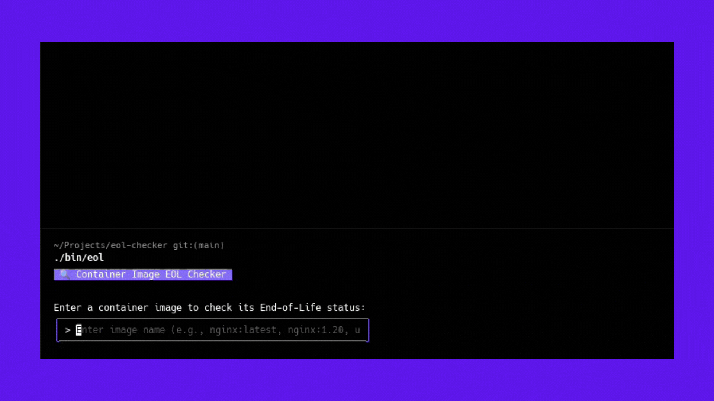

# EOL Checker

A TUI for checking container image End-of-Life status,  built with Go and powered by [endoflife.date](https://endoflife.date).

<p align="center" width="100%">



</p>

## Quick Start

```bash
git clone https://github.com/HMZElidrissi/eol-checker.git
cd eol-checker
make deps && make build
./bin/eol
```

## Usage

Enter any container image name:
- `nginx:1.20` 
- `ubuntu:22.04`
- `node:16-alpine`
- `postgres:13`

## Status Indicators

- 🚨 **CRITICAL** - EOL reached / discontinued
- ⚠️ **WARNING** - EOL within 30 days  
- ℹ️ **INFO** - EOL within 90 days
- ✅ **OK** - Currently supported
- ❓ **UNKNOWN** - Not found in database

## Install

```bash
make install  # Installs to /usr/local/bin/eol
```